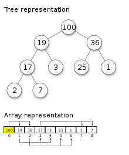
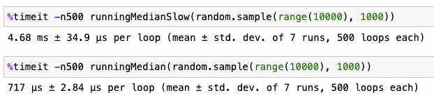

## Motivation: Running Medians

Let's say you have a rapidly streaming data, you need to keep tracking of the running mean, minimum and maximum values. Since sorting a list of values is `O(n log(n))`, 
it is not feasible to continuously calculate these relevant statistics after every update. Instead, we need to have a very efficient way of keeping track
and updating these numbers in real time.

My motivation for writing this post actually came from a different problem; calculating the running median of a continuous stream. When it comes to the mean,
it is straightforward: given the mean `M` and new value `X` and the current number of values `N`, the new mean is simply: 

$$ 
\frac{N*M+X}{N+1} 
$$

However, when it comes to the median, it is not as straightforward, since we need to know the mid-value of an ordered list! My initial approach for this was to
keep an ordered list that inserts the new value into the right place (found by bisecting recursion) in a continuously growing array, given a list `input`:

```python
# Recursive method to find the right index to insert the new value
# Runs in O(log(n))
def get_loc(ordered_arr, i):
    # Base case for recursion
    if len(ordered_arr) == 0:
        return 0
    check_ind = len(ordered_arr) // 2
    # Recursion occurs by feeding a smaller verison of the original array and 
    # adding the number of values that come before the split array
    if i < ordered_arr[check_ind]:
        return 0 + get_loc(ordered_arr[:check_ind], i)
    if i > ordered_arr[check_ind]:
        return check_ind + 1 + get_loc(ordered_arr[check_ind+1:], i)
    else:
        return check_ind
    
# Method that splits the list by the index discovered by get_loc(),
# grow it, and calculate the median by looking at the middle value
def runningMedian(input):
    ordered_arr = []
    meds = []
    incr = 0
    for entry in a:
        insert_ind = get_loc(ordered_arr, entry)
        # print('Insert %s into ind %s for %s' % (entry, insert_ind, ordered_arr))
        # Split, insert, and re-combine!
        ordered_arr = ordered_arr[:insert_ind] + [entry] + ordered_arr[insert_ind:]
        incr += 1
        # Now we can calculate the median
        med = ordered_arr[len(ordered_arr)//2] if len(ordered_arr) % 2 == 1 else \ 
            (ordered_arr[len(ordered_arr)//2] + ordered_arr[len(ordered_arr)//2 - 1]) / 2
        meds.append(float(med))
        
    return meds
```

This method DOES give the right answers, but needless to say, it is inefficient, even though the run-time itself is O(n log(n)).
We need to think deeper about it - if all we're interested in is the running median, there should be no need to keep track of this very cumbersome array that can be
thousands, millions or billions of values!

The change in perspective should come from the fact that this is a very similar problem to keeping track of either min or max of a running list (Do you see how?)
If I were asked to keep track of the mininum of streaming values, how would I have approached this problem? Hmm... 🤔

## Heap to the rescue!

A heap is a tree-based data structure that satisfies the heap property: if you want to have a max heap, the simple restriction is that your parent is larger than you (or equal).
In a min heap, the opposite is true:



The key property that makes heaps very useful is that when inserting a new value or popping the max (in a max heap) or min (in a min heap) value is very fast! 
In case you're wondering how the insertion and popping operations happen, refer to the first two minutes of this video:



So, let's take a quick diversion to write obtain a running min values using a min heap; in python, this can be done using `heapq`. 
Note that in python, the root element is referred by the `0`-element:

```python
import heapq

def runningMin(input):
    h = []
    mins = []
    for entry in a:
        heapq.heappush(h, entry)
        mins.append(h[0])
        
    return mins
```

That's great, but how is this problem relevent for the original problem of getting a running median? The trick is to **combine** a min heap and max heap; keep the smaller half of the
elements in a max heap and the larger half of the elements in a min heap. As long as we are careful to keep the size of each heap equal (or max heap has one more element than min heap),
now getting the median value is just either taking the max element of the min heap (if there are odd number of elements) or the average of the two roots (if there are even number of elements)!

```python
import heapq

def runningMedian(input):
    h_small = []
    h_large = []
    meds = []
    # Initialize - Note that I'm inverting the values going into 
    # h_small to effectively keep it a max heap
    heapq.heappush(h_small, -1*input[0])
    meds.append(input[0])
    heapq.heappush(h_small, -1*input[1])
    meds.append((input[0] + input[1]) / 2)
    # Balance the heaps - invert the sign again
    a = heapq.heappop(h_small)
    heapq.heappush(h_large, -1*a)

    ind = 2
    # Now we begin the loop
    for entry in input[2:]:
        if entry < h_large[0]:
            # insert into min heap
            heapq.heappush(h_small, -1*entry)
        else:
            heapq.heappush(h_large, entry)
        # Re-balance
        if len(h_small) > len(h_large) + 1:
            a = heapq.heappop(h_small)
            heapq.heappush(h_large, -1*a)
        elif len(h_large) > len(h_small):
            a = heapq.heappop(h_large)
            heapq.heappush(h_small, -1*a)

        ind += 1
        med = -1*h_small[0] if ind % 2 == 1 else (-1*h_small[0] + h_large[0]) / 2
        meds.append(med)
        
    return meds
```

This is a much faster solution. How much faster are we talking? I tested both methods 500 times using a random list of 1000 elements (Python 3.9.17), and the first method ran in 
`~4.7 ms` while the second method ran in `~720 μs`! That is almost a 7-fold decrease, and we have a clear winner here.



### Other useful heapq functions

```python
heapq.heapify(x)
# Transform list x into a heap, in-place, in linear time.

heapq.merge(*iterables, key=None, reverse=False)
# Merge multiple sorted inputs into a single sorted output (for example, 
# merge timestamped entries from multiple log files). Returns an iterator over the sorted values.

heapq.nlargest(n, iterable, key=None)
# Return a list with the n largest elements from the dataset defined by iterable. 
# key, if provided, specifies a function of one argument that is used to extract a 
# comparison key from each element in iterable (for example, key=str.lower).

heapq.nsmallest(n, iterable, key=None)
# Similar to nlargest, but for smallest
```

## Real-life application: Priority queues

Another very useful real-life scenario that uses heaps as its data structure, is a queueing system which should not simply work as FIFO (First-In-First-Out), but has a priority number associated with them. In a situation where higher-priority tasks should be completed before lower-priority ones (for example, in the Emergency Room, where patients with more severe conditions need to be treated as a higher priority), a very efficient implementation of such a queueing system can be written like this (example taken directly from python documentation page for heapq: https://docs.python.org/3/library/heapq.html ):

```python
pq = []                         # list of entries arranged in a heap
entry_finder = {}               # mapping of tasks to entries
REMOVED = '<removed-task>'      # placeholder for a removed task
counter = itertools.count()     # unique sequence count

def add_task(task, priority=0):
    'Add a new task or update the priority of an existing task'
    if task in entry_finder:
        remove_task(task)
    count = next(counter)
    entry = [priority, count, task]
    entry_finder[task] = entry
    heappush(pq, entry)

def remove_task(task):
    'Mark an existing task as REMOVED.  Raise KeyError if not found.'
    entry = entry_finder.pop(task)
    entry[-1] = REMOVED

def pop_task():
    'Remove and return the lowest priority task. Raise KeyError if empty.'
    while pq:
        priority, count, task = heappop(pq)
        if task is not REMOVED:
            del entry_finder[task]
            return task
    raise KeyError('pop from an empty priority queue')
```

In this example, there are two data structures that keep track of the tasks: a priority queue (heap) `pq`, and a dictionary `entry_finder`. Keeping both data structures allows us to not only add and pop the highest priority tasks, but also to remove a specific task that is not necessarily at the root of the heap, with the `remove_task()` function.

## Summary

In this post, we took a deep dive into a very specific data structure - heaps. Heaps are highly efficient for managing priorities, with their ability to provide fast access to the 'highest' or 'lowest' value making them particularly useful in numerous real-life applications. Knowing how heaps are used, and also recognizing where they are being used, can be a very helpful tool in your DSA arsenal.
