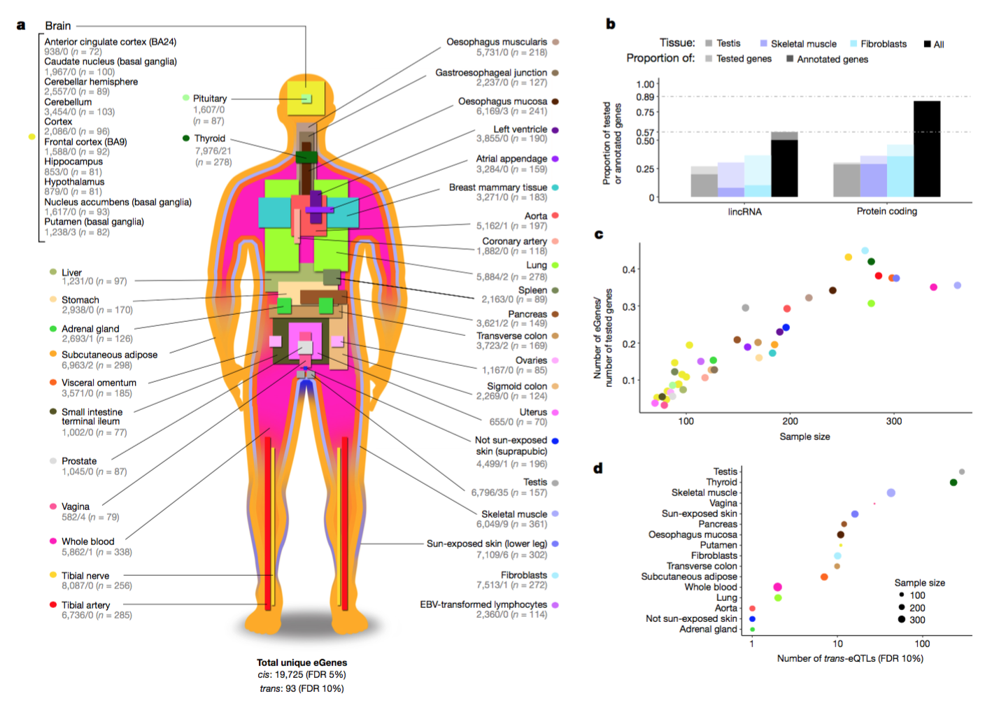

## About

Brian is a Ph.D. candidate in Statistical Genetics under the mentorship of [Barbara Engelhardt](http://beehive.cs.princeton.edu/), and is part of the Graduate Program in [Quantitative and Computational Biology](http://lsi.princeton.edu/qcbgraduate) at Princeton University. Brian works with the human genome and transcriptome, and is a contributor to the [Genotype-Tissue Expression (GTEX)](http://www.gtexportal.org/home/) consortium. 

#### Research Interests

Brian is primariliy pursuing the following research directions, all of which are inter-related:

- Structures and statistical properties of genome-wide association studies at gene-level and tissue-level for multiple testing correction and significance testing
- Developing and testing various methods for tissue-specific transcriptome causal inference with genetic instrumental variable analysis (Mendelian Randomization)
- Understanding the structure of human transcriptome via various sparse and dense Factor Analysis approaches 

## Main publications

#### [Genetic effects on gene expression across human tissues](https://www.nature.com/articles/nature24277) - one of the main contributors for distal eQTLs

The Genotype-Tissue Expression (GTEx) project aims to characterize variation in gene expression levels across individuals and diverse tissues of the human body, many of which are not easily accessible. This work describes the genetic effects on gene expression levels across 44 human tissue, and finds that local genetic variation affects gene expression levels for the majority of genes. This work further identifies inter-chromosomal genetic effects for 93 genes and 112 loci. On the basis of the identified genetic effects, we characterize patterns of tissue specificity, compare local and distal effects, and evaluate the functional properties of the genetic effects. We also demonstrate that multi-tissue, multi-individual data can be used to identify genes and pathways affected by human disease-associated variation, enabling a mechanistic interpretation of gene regulation and the genetic basis of disease.

---

#### (Abstract) [Distant regulatory effects of genetic variation in multiple human tissues](https://www.biorxiv.org/content/early/2016/09/09/074419)

Abstract version of the above publication.

---

## Additional publications, external Links

[ORCiD](http://orcid.org/0000-0002-9641-7948) (QR code on the right) 

[Google Scholar](http://scholar.google.com/citations?view_op=list_works&hl=en&user=YoYxpiYAAAAJ)

[LinkedIn](http://www.linkedin.com/in/jobrian/)

[Personal Site (constantly under construction)](http://brians.zone)
